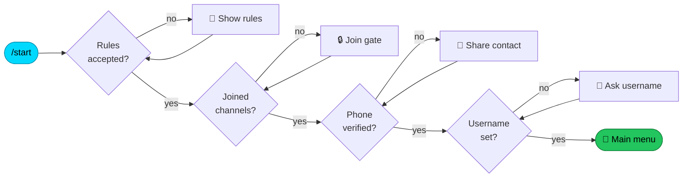
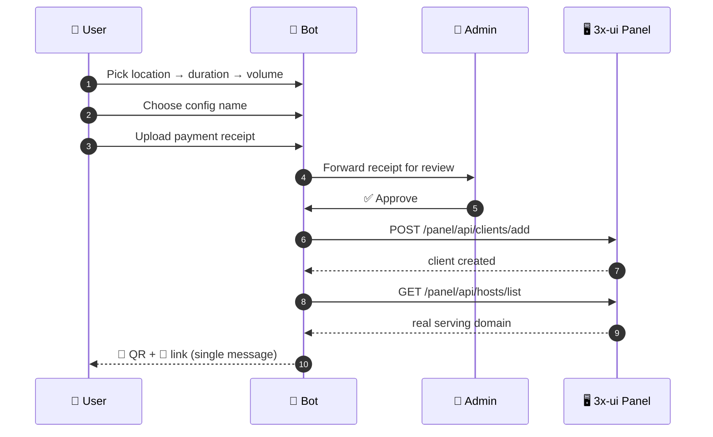

<div align="center">


<br/>


<br/>


<br/><br/>

<h3>A production-grade Persian Telegram bot for selling & provisioning VPN configs</h3>
<p><i>Fully automated: buy → pay → provision on 3x-ui → deliver QR + link</i></p>


</div>

---

## ✨ Highlights

<table>
<tr>
<td width="50%" valign="top">

### 🛒 For Customers
- **Hierarchical buy flow** — location → duration → volume
- **Custom config naming** — pick your own service name
- **One-message delivery** — QR image + link + full details
- **Live usage stats** — remaining GB, % used, days left
- **Import existing configs** — paste any `vless/vmess/trojan/ss` link
- **Wallet, referrals, tickets, FAQ** built in

</td>
<td width="50%" valign="top">

### 👑 For Admins
- **Three-tier roles** — user / sub-admin / head-admin
- **Full UI customization** — every text, emoji, banner & button
- **Premium (animated) emoji** support in messages
- **Forced channel join** — add/remove channels live
- **Plan editor** — price, volume, duration, location
- **Death Note dev panel** — stop / start / lockdown the bot

</td>
</tr>
</table>

---

## 🧭 Onboarding Flow



## 🔄 Purchase → Provision Pipeline



---

## 🏗 Architecture

```
velavpn-bot/
├── main.py                      # Entry point · routers & middleware wiring
├── config/settings.py           # Env config + smart ADMIN_IDS (DB-aware)
│
├── handlers/                    # Telegram update handlers
│   ├── onboarding.py            #   rules → join → phone → username
│   ├── user_shop.py             #   hierarchical buy flow
│   ├── user_extra.py            #   my configs · referrals · partnership
│   ├── admin_payment_review.py  #   approve → provision → deliver
│   ├── head_admin_panel.py      #   servers · admins · channels · settings
│   ├── admin_ui_settings.py     #   texts / emojis / banners / colors
│   ├── glass_menu.py            #   inline ("glass") menu mode
│   └── dev_control.py           #   Death Note developer panel
│
├── services/
│   ├── xui_service.py           # 3x-ui client: login · provision · links · stats
│   ├── ui_render.py             # premium-emoji aware message rendering
│   ├── ui_texts.py              # T(key, default) editable-text reader
│   └── banner_service.py        # per-screen banners
│
├── database/
│   ├── db.py                    # connection pool · WAL · settings cache
│   ├── migration.py             # additive schema migrations
│   └── backup.py                # automated 24h backups
│
└── keyboards/                   # dynamic keyboards (renamable buttons)
```

### Design decisions worth knowing

| Concern | Approach |
|---|---|
| **Renamable buttons** | A custom `Btn` filter resolves the *live* setting value, so renaming a button from the admin panel never breaks its handler |
| **Role gating** | `ADMIN_IDS` is a smart object whose `__contains__` also queries the DB — every `x in ADMIN_IDS` check became DB-aware with zero call-site edits |
| **Concurrency** | SQLite connection pool (LIFO, max 8) + `WAL` + `busy_timeout` + periodic checkpoint |
| **Caching** | Settings table cached (5 s TTL); content pages cached (10 s TTL) |
| **Correct domain** | Read live from the panel's **Hosts** section — never a stale IP or `externalProxy` |
| **Premium emoji** | Persist message text **and** its `custom_emoji` entities, then replay them on send |

---

## 🚀 Quick Start

```bash
git clone https://github.com/mhndev3/velavpn-bot.git
cd velavpn-bot

python -m venv venv
source venv/bin/activate        # Windows: venv\Scripts\activate

pip install -r requirements.txt
cp .env.example .env            # then fill it in
python main.py
```

### Environment

```env
BOT_TOKEN=123456:ABC...              # from @BotFather
ADMIN_IDS=11111111,22222222          # static head-admins (comma separated)
DEVELOPER_ID=11111111                # unlocks /deathnote
ADMIN_REPORT_CHANNEL_ID=-100...      # order notifications

USE_PROXY=false                      # optional SOCKS/HTTP proxy
PROXY_TYPE=socks5
PROXY_HOST=127.0.0.1
PROXY_PORT=1080
```

> [!IMPORTANT]
> `.env`, `bot.db` and `backups/` are git-ignored on purpose. They hold your bot token, live customer data and admin-authored UI content. **Never** commit or overwrite them during a deploy.

---

## 📦 Deployment (pm2)

```bash
# copy code files ONLY — never .env / bot.db / backups / venv
cd ~/velavpn-bot
venv/bin/pip install -r requirements.txt
pm2 restart velavpn && pm2 logs velavpn
```

Schema migrations run automatically on boot, so a plain restart is enough.

---

## 🎛 Admin Panel Tour

| Section | What you can change |
|---|---|
| 🎨 **UI Settings** | Every user-facing text, emoji, banner and button label — live, no restart |
| 🖥 **Servers** | Add 3x-ui panels, test connections, list inbounds, override domain |
| 📦 **Plans** | Create & **edit** plans: price, volume, duration, location |
| 📢 **Channels** | Forced-join channels (add via `@username`, link, or forward) |
| 👑 **Head Admins** | Grant/revoke full panel access by numeric ID |
| ⚙️ **Bot Settings** | Card number, referral %, glass-button mode, DB download |
| 💀 **`/deathnote`** | Developer-only: `Stop` · `Start` · `L` (lockdown) · `K` (unlock) |

---

## 🗺 Roadmap

- [x] Hierarchical buy flow with custom config names
- [x] Domain auto-resolution from the panel's Hosts section
- [x] Premium (animated) emoji in bot messages
- [x] Forced channel join + full onboarding gate
- [x] Live usage stats & percentage bars
- [ ] **Telegram Mini App** — fully styled UI with real button colors
- [ ] Cross-platform client (Flutter + Xray-core)
- [ ] Advanced analytics dashboard

---

## 🤝 Contributing

Issues and pull requests are welcome. For substantial changes, please open an issue first to discuss what you'd like to change.

## 📄 License

Released under the [MIT License](LICENSE).

---

<div align="center">

**Built with care for real customers.**

<sub>Made by <a href="https://github.com/mhndev3">@mhndev3</a> · Powered by aiogram & 3x-ui</sub>

</div>
